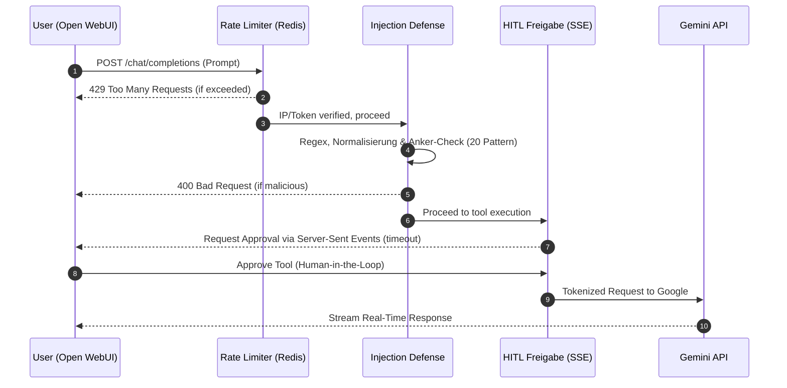
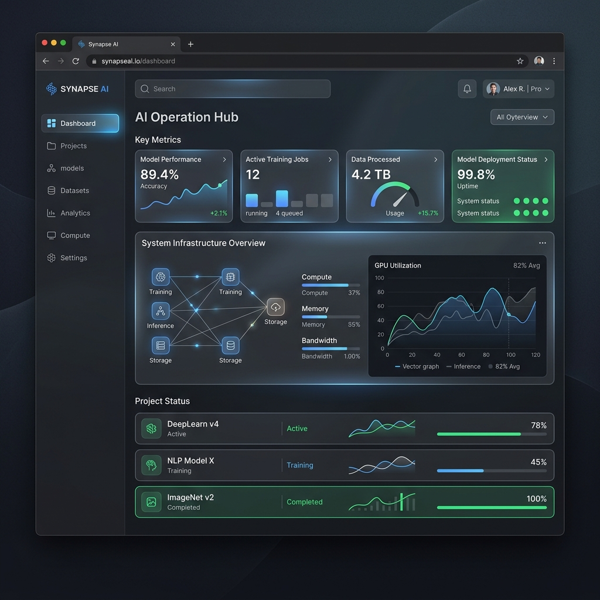

<div align="center">

# 🤖 AI-Workhorse v8

**Die DSGVO-konforme KI-Assistenz-Plattform mit absoluter Datenkontrolle**

[](https://fastapi.tiangolo.com/)
[](https://nextjs.org/)
[](https://python.org/)
[](https://postgresql.org/)
[](https://docker.com/)

*Sicher. Souverän. Transparent. Keine Kompromisse.*

---


*(Hinweis: Dies ist ein mock-up Platzhalter. Wenn deine App fertig ist, ersetzt du diesen durch reale Aufnahmen der fantastischen Oberfläche!)*

</div>

<br>

> **AI-Workhorse v8** bringt modernste KI-Workflows in deine eigene Infrastruktur. Durch die Kombination des neuesten *Google Generative AI SDK* (Gemini 2.0) mit einer kompromisslosen On-Premises Sicherheitsarchitektur bleiben alle deine sensiblen Daten genau dort, wo sie hingehören: Bei dir.

---

## ✨ Premium Features

Hier trifft ein ultra-kompatibles OpenAI-Interface auf ein eigens gehärtetes Backend.

| 🛡️ Security & Control | 🧠 AI & RAG Pipeline | ⚡ Performance & Architektur |
| :--- | :--- | :--- |
| **Dreistufige Injection-Defense**<br>Abwehr von Jailbreaks & Role-Injection. | **Native RAG Integration**<br>PDF-Uploads und automatische Chunking-Pipeline. | **Token-Bucket Rate Limiter**<br>IP-/Token-basierter Redis-Schutz (10 Req/Min). |
| **Human-in-the-Loop (HITL)**<br>Manuelle Freigabe via Server-Sent Events (SSE). | **pgvector Ähnlichkeitssuche**<br>Millisekunden-genaues Vector-Embedding (768 Dim). | **Next.js 15 & Tailwind v4**<br>Modernes, pfeilschnelles Überwachungs-Dashboard. |
| **API-Key Auth**<br>Abgesichert über asymmetrisches Token-Hashing. | **Open WebUI Chat**<br>Volle Kompatibilität zur OpenAI API Spezifikation. | **Automatisches HTTPS**<br>Caddy Reverse Proxy mit Let's Encrypt für VPS. |

---

## 🏗️ Systemarchitektur

Das Zusammenspiel von 5 isolierten Docker-Containern garantiert Stabilität und Skalierbarkeit:

```mermaid
flowchart TD
    User([Browser / User]) -- "HTTPS (443)" --> Caddy[Caddy Reverse Proxy\n TLS Let's Encrypt]
    
    subgraph Frontend [UI Layer]
        Caddy -- "HTTP" --> WebUI(Open WebUI\nPort 3002)
        Caddy -- "HTTP" --> Dashboard(Next.js Dashboard\nPort 3000)
    end
    
    subgraph Backend [AI Engine Layer]
        WebUI -- "REST /v1\nBearer Token" --> API{FastAPI Backend\nPort 8000}
        Dashboard -- "Status Checks" --> API
    end
    
    subgraph Data [Storage & Cache]
        API -- "Rate Limiting\nCaching" --> Redis[(Redis 7)]
        API -- "pgvector Queries\nFile Metadata" --> Postgres[(PostgreSQL 16)]
    end
    
    API -- "Google Generative AI SDK" -.-> Gemini((Gemini 2.0 API))
```

---

## 🛡️ Sicherheitsarchitektur: Der Weg eines Requests

Jeder Prompt durchläuft unsere strikte Sicherheits- und Freigabekette:



---

## 🚀 Schnellstart

### Voraussetzungen

- [Docker](https://docs.docker.com/get-docker/) & [Docker Compose](https://docs.docker.com/compose/install/)
- [Google Gemini API-Key](https://aistudio.google.com/app/apikey)

### 1. Klonen & Setup

```bash
git clone https://github.com/Infinizius/Aiworkhorse-v8.git
cd Aiworkhorse-v8
cp .env.example .env
```
*Trage in der `.env` anschließend deine eigenen sicheren Passwörter und Schlüssel ein (insbesondere `GEMINI_API_KEY`, `POSTGRES_PASSWORD`, `WEBUI_SECRET_KEY`).*

### 2. Services starten

```bash
docker compose up -d
```

Alle Services stehen danach lokal bereit:
- 💬 **Chat UI:** [http://localhost:3002](http://localhost:3002) - Das Haupt-Interface
- 📊 **Dashboard:** [http://localhost:3000](http://localhost:3000) - Realtime-Systemstatus
- ⚙️ **API Docs:** [http://localhost:8000/docs](http://localhost:8000/docs) - Swagger Interface

### 3. Logs überwachen

```bash
# Gesamte Infrastruktur
docker compose logs -f

# Spezifisch für das FastAPI Backend
docker compose logs -f api
```

---

## 🔒 Produktion: Hetzner VPS Deployment (HTTPS)

Für den sicheren Betrieb auf einem öffentlich erreichbaren Hetzner VPS (z.B. CAX21) übernimmt **Caddy** als Reverse Proxy automatisch die Ausstellung und Verwaltung der TLS-Zertifikate.

1. **DNS einrichten:** Ein A-Record (`chat.deinedomain.com`) muss auf die VPS IP zeigen.
2. **Ports öffnen:** In der Hetzner Firewall Port `80` und `443` öffnen. Alle anderen (z.B. 8000, 5432) bleiben geschlossen!
3. **Start mit Produktionsprofil:**
   ```bash
   # DOMAIN in der .env muss gesetzt sein!
   docker compose --profile prod up -d
   ```
   Caddy konfiguriert das Let's Encrypt Zertifikat nun vollautomatisch und routet alle Requests per HTTPS.

---

## 📊 Status-Dashboard

Hier der Ausblick auf das Next.js Verwaltungs-Dashboard unserer Architektur:

<div align="center">
  
  <br>
  <em>(Hinweis: Dies ist ein Mock-up-UI. In künftigen Versionen ersetzen durch das tatsächliche Next.js Dashboard Layout.)</em>
</div>

---

## 🗺️ Entwicklungs-Roadmap

Der aktuelle MVP (v1.0 Candidate) ist bis Meilenstein 6 **weitestgehend funktionsfähig**. Basis-Sicherheit, RAG-Pipeline und Auth arbeiten zuverlässig, wenngleich in der API noch finale "Production Ready Checkpoints" wie Unit-Tests anstehen.

```text
Infrastruktur                ████████████████████░░  ~95% (Caddy & 5 Services up)
Backend & RAG Logic          █████████████████░░░░░  ~80% (Google API SDK fully wired)
Frontend / Dashboard         ███████████░░░░░░░░░░░  ~55% 
Security Base                ████████████████████░░  ~90% (Token Hash, Injection checks run)
Testing Suite (M8)           ░░░░░░░░░░░░░░░░░░░░░░  0% (No PyTest / Vitest yet)
─────────────────────────────────────────────────────────────────
Gesamt MVP                   ████████████████░░░░░░  ~75%
```
👉 *Die detaillierte Feature-Roadmap findest du in der [ROADMAP.md](ROADMAP.md)*

---

## 🤝 Beitragen & Lizenz

Beiträge sind jederzeit willkommen! Da wir uns dem Ende des V1 MVP nähern, sind besonders Pull Requests für **Tests (`pytest`)** oder robuste Infrastruktur-Scans (`GET /health`) gesucht.

Dieses Projekt steht unter der [MIT-Lizenz](LICENSE). 

<div align="center">
  <br>
  <b>AI-Workhorse v8</b> – Gebaut mit ❤️ für DSGVO-konforme KI
</div>
