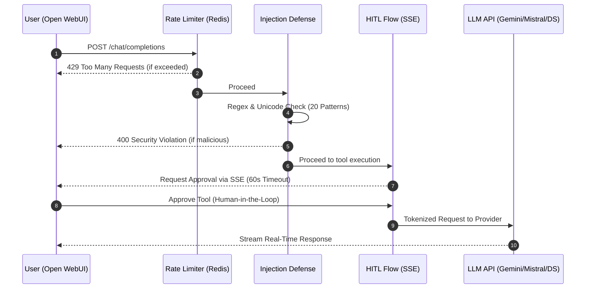

<div align="center">
  
# 🤖 AI-Workhorse v8.1 (Stable)

**Die DSGVO-konforme KI-Assistenz-Plattform mit Multi-Model Support & absoluter Datenkontrolle**

[](https://fastapi.tiangolo.com/)
[](https://nextjs.org/)
[](https://python.org/)
[](https://postgresql.org/)
[](https://docker.com/)
[](backend/tests/)

*Sicher. Souverän. Multi-Modal. Keine Kompromisse.*

---


*(v1.0 Stable: Alle Kernsysteme inkl. RAG und Multi-LLM-Routing sind aktiv!)*

</div>

<br>

> **AI-Workhorse v8.1** bringt modernste KI-Workflows in deine eigene Infrastruktur. Durch die Kombination von **Gemini 1.5/3.0**, **Mistral AI** und **DeepSeek V3** mit einer kompromisslosen On-Premises Sicherheitsarchitektur bleiben alle deine sensiblen Daten genau dort, wo sie hingehören: Bei dir.

---

## ✨ Premium Features (v1.0)

Hier trifft ein ultra-kompatibles OpenAI-Interface auf ein eigens gehärtetes Backend.

| 🛡️ Security & Control | 🧠 AI & RAG Pipeline | ⚡ Performance & Qualität |
| :--- | :--- | :--- |
| **Dreistufige Injection-Defense**<br>Regex, Unicode-Normalisierung & System-Anker. | **Native RAG Integration**<br>PDF-Parsing & pgvector Ähnlichkeitssuche (768 Dim). | **Multi-Model Routing**<br>Gemini, Mistral & DeepSeek (Reasoning) nahtlos integriert. |
| **Human-in-the-Loop (HITL)**<br>Tool-Freigabe via SSE-Heartbeat-Mechanismus. | **API-Key Auth & Rate Limit**<br>IP-/Token-basierter Redis-Schutz (10 Req/Min). | **Automatisches HTTPS**<br>Caddy Reverse Proxy mit Let's Encrypt für VPS. |
| **Production Logging**<br>Strukturierte JSON-Logs & Public Health-Monitoring. | **Open WebUI Chat**<br>Volle OpenAI-Kompatibilität für alle gängigen Frontends. | **39 Automated Tests**<br>Vollständige Backend-Absicherung (pytest). |

---

## 🏗️ Systemarchitektur

Das Zusammenspiel von 5 isolierten Docker-Containern garantiert maximale Ausfallsicherheit:

```mermaid
flowchart TD
    User([Browser / User]) -- "HTTPS (443)" --> Caddy[Caddy Reverse Proxy\n TLS Let's Encrypt]
    
    subgraph Frontend [UI Layer]
        Caddy -- "HTTP" --> WebUI(Open WebUI\nPort 3002)
        Caddy -- "HTTP" --> Dashboard(Next.js Dashboard\nPort 3000)
    end
    
    subgraph Backend [AI Engine Layer]
        WebUI -- "REST /v1\nBearer Token" --> API{FastAPI Backend\nPort 8000}
        Dashboard -- "Status Checks /health" --> API
    end
    
    subgraph Data [Storage & Cache]
        API -- "Rate Limiting" --> Redis[(Redis 7)]
        API -- "pgvector / RAG" --> Postgres[(PostgreSQL 16)]
    end
    
    API -- "Multi-Provider SDKs" -.-> LLMs((Gemini / Mistral / DeepSeek))
```

---

## 🛡️ Der Request-Lifecycle (HITL & Security)

Jeder Prompt durchläuft unsere strikte Sicherheits- und Freigabekette:



---

## 🚀 Schnellstart

### Voraussetzungen

- [Docker](https://docs.docker.com/get-docker/) & [Docker Compose](https://docs.docker.com/compose/install/)
- Erforderlich: [Google Gemini API-Key](https://aistudio.google.com/app/apikey)
- Optional: Mistral AI / DeepSeek API-Keys

### 1. Klonen & Setup

```bash
git clone https://github.com/Infinizius/Aiworkhorse-v8.git
cd Aiworkhorse-v8
cp .env.example .env
```
*Trage in der `.env` deine Schlüssel ein. Das System ist nach dem Start sofort unter dem konfigurierten `API_KEY` erreichbar.*

### 2. Services starten

```bash
docker compose up -d
```

- 💬 **Chat UI:** [http://localhost:3002](http://localhost:3002)
- 📊 **Dashboard:** [http://localhost:3000](http://localhost:3000)
- ⚙️ **API Docs:** [http://localhost:8000/docs](http://localhost:8000/docs)
- 🩺 **Health:** [http://localhost:8000/readyz](http://localhost:8000/readyz)

### 3. Tests ausführen

```bash
# Backend-Tests (im Container)
docker exec -it ai-workhorse-api pytest tests/ -v
```

---

## 🗺️ Entwicklungs-Status: v1.0 STABIL

Das System hat alle Meilensteine der Initial-Entwicklung erfolgreich abgeschlossen.

```text
Infrastruktur (Docker/Caddy)   ███████████████████████  100% ✅
Backend & Multi-LLM Logic      ███████████████████████  100% ✅
RAG Pipeline (pgvector)        ███████████████████████  100% ✅
Security & Auth                ███████████████████████  100% ✅
Testing Suite (39 Tests)       ███████████████████████  100% ✅
Dokumentation (M9)             ███████████████████████  100% ✅
─────────────────────────────────────────────────────────────────
GESAMTSTATUS v1.0              ███████████████████████  100% STABIL
```

---

## 🤝 Roadmap & Phase 2

Die Reise endet nicht bei v1.0. Wir bereiten bereits folgende Erweiterungen vor:
- **LangGraph-Agents:** Autonome Goal-Engine für komplexe Tasks.
- **Redis-Caching:** Performance-Boost für RAG-Anfragen.
- **Enterprise Security:** JWT/OAuth2 & DB-at-Rest Verschlüsselung.

---

<div align="center">
  <br>
  <b>AI-Workhorse v8.1</b> – Gebaut mit ❤️ für DSGVO-konforme KI
</div>
