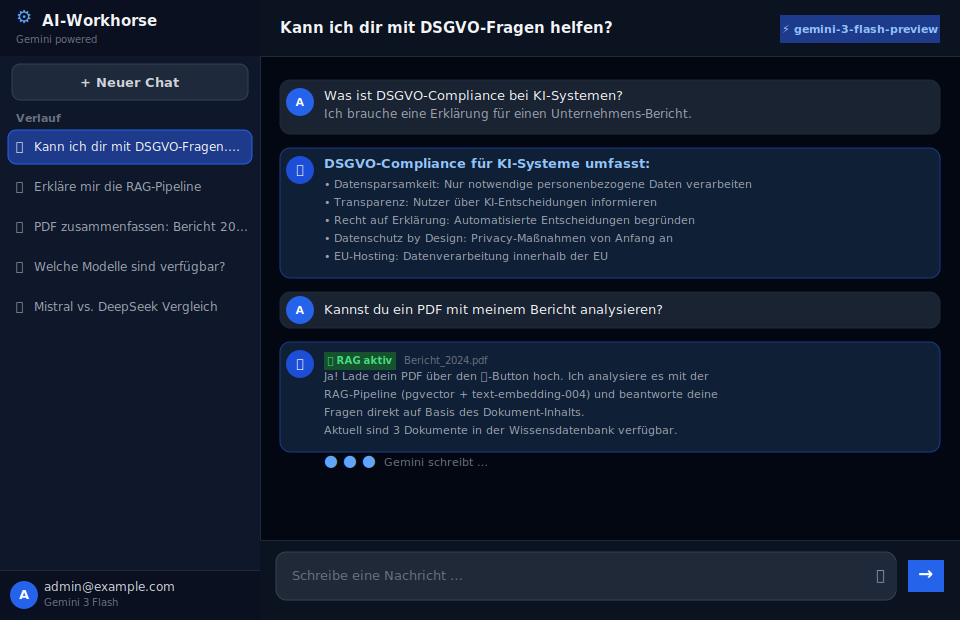
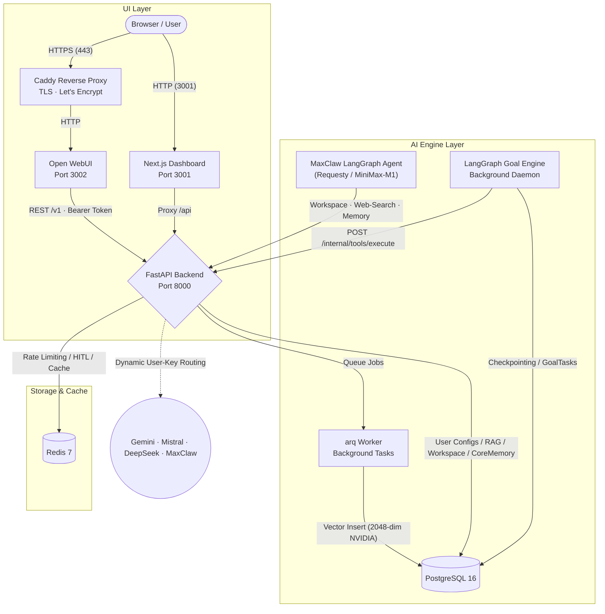

<div align="center">
  
# 🤖 AI-Workhorse v1.1 · Phase-2 · Phase-3 · Phase-4

**Die DSGVO-konforme KI-Assistenz-Plattform mit Multi-Model Support, autonomem MaxClaw-Agenten & absoluter Datenkontrolle**

[](https://fastapi.tiangolo.com/)
[](https://nextjs.org/)
[](https://python.org/)
[](https://postgresql.org/)
[](https://docker.com/)
[](https://redis.io/)

*Sicher. Souverän. Multi-Modal. Gehärtet. Autonom.*

---


*(Open WebUI Chat · Gemini / Mistral / DeepSeek / MaxClaw · RAG-Pipeline mit PDF-Upload · persistentes HITL)*


*(Next.js Dashboard · Service-Status · Dokumente · Workspace · API-Docs via Proxy)*

</div>

<br>

> **AI-Workhorse v1.1 + Phase-2/3/4** hebt die Plattform auf Enterprise-Niveau. Neben **nutzerspezifischen API-Keys (Fernet: AES-128-CBC + HMAC-SHA256)**, **asynchroner PDF-Verarbeitung (arq Worker)** und **persistenten Tool-Freigaben (Redis)** ist jetzt auch der vollständige **MaxClaw LangGraph-Agent** (Phase 3) mit Workspace-Tools und persistentem Core-Memory sowie eine **JWT-gesicherte Workspace-Dashboard-UI** (Phase 4) vorhanden.

---

## ✨ Premium Features (v1.1 Hardened · Phase-2 · Phase-3 · Phase-4)

Hier trifft ein ultra-kompatibles OpenAI-Interface auf ein eigens gehärtetes Backend mit autonomem Agenten-Layer.

| 🛡️ Security & Privacy | 🧠 AI & RAG Pipeline | ⚡ Performance & Resilience |
| :--- | :--- | :--- |
| **User-Specific API Keys**<br>Speicherung von Anbieter-Keys (Gemini/Mistral/DS) – Fernet-verschlüsselt (AES-128-CBC) in der DB. | **Asynchronous PDF Processing**<br>Hintergrund-Vektorisierung via `arq` Worker für verzögerungsfreie Uploads. | **Persistent HITL (Redis)**<br>Tool-Freigaben überleben Server-Restarts und skalieren über mehrere Instanzen. |
| **Dreistufige Injection-Defense**<br>Regex, Unicode-Normalisierung & System-Anker. | **NVIDIA Embeddings (2048-dim)**<br>`nvidia/llama-3.2-nv-embedqa-1b-v2` via NVIDIA NIM für hochpräzises RAG-Retrieval. | **RAG-Aware Caching**<br>SHA256 Prompt-Caching in Redis reduziert API-Kosten für identische Anfragen. |
| **Souveräne Identität**<br>Header-basierte Nutzer-Erkennung (X-User-Email) via Open WebUI Proxy. | **Multi-Model Routing**<br>Dynamisches Key-Routing pro User & Provider (Gemini/Mistral/DeepSeek/MaxClaw). | **Automatisches HTTPS**<br>Caddy Reverse Proxy mit Let's Encrypt für VPS. |
| **Autonome Goal-Tasks**<br>`/v1/goals` speichert geplante oder einmalige Ziele persistent in Postgres. | **Interner Tool-Server**<br>`/internal/tools/execute` vermeidet Tool-Code-Duplizierung zwischen API und Daemon. | **Goal-Engine Daemon**<br>Separater LangGraph-Worker mit Postgres-Checkpointing und `X-Source: goal-engine` Guard. |
| **JWT Workspace-Dashboard**<br>Magic-Link-Auth via HMAC-SHA256, 1h TTL. `/workspace`-Befehl im Chat öffnet Dashboard. | **MaxClaw LangGraph-Agent**<br>Vollständiger Supervisor-Agent via Requesty; Workspace read/write, Web-Suche, Core-Memory. | **Persistentes Core-Memory**<br>`CoreMemory`-Tabelle speichert dauerhaftes Nutzer-Wissen; wird bei jedem MaxClaw-Aufruf injiziert. |
| **Token Vault**<br>`/v1/agent/register` speichert OpenWebUI API-Keys Fernet-verschlüsselt (UserVault-Tabelle). | **Web-Search mit Fallback**<br>MaxClaw-Agent: Serper (primär) → DuckDuckGo HTML-Scraper (kostenloser Fallback). | **Path-Traversal-Schutz**<br>Workspace-Tools validieren alle Pfade mit `os.path.abspath` gegen `{workspace}/{user_id}/`. |

---

## 🏗️ Systemarchitektur (v1.1 + Phase-2/3/4)

Das Zusammenspiel von 7 Core-Containern (+ optionalem Caddy im Prod-Profil) garantiert maximale Ausfallsicherheit:



---

## 🚀 Schnellstart

### Voraussetzungen

- [Docker](https://docs.docker.com/get-docker/) & [Docker Compose](https://docs.docker.com/compose/install/)
- Erforderlich: [Google Gemini API-Key](https://aistudio.google.com/app/apikey)
- Erforderlich: [NVIDIA NIM API-Key](https://build.nvidia.com) (für RAG-Embeddings: `nvidia/llama-3.2-nv-embedqa-1b-v2`, 2048-dim)
- Erforderlich: `ENCRYPTION_KEY` in deiner `.env` (für Fernet-Schlüsselableitung)

### 1. Klonen & Setup

```bash
git clone https://github.com/Infinizius/Aiworkhorse-v8.git
cd Aiworkhorse-v8
cp .env.example .env
```
*WICHTIG: Setze einen starken `ENCRYPTION_KEY` in der `.env`. Ohne diesen Schlüssel können nutzerspezifische Keys nicht verschlüsselt gespeichert werden.*

### 2. Services starten

```bash
docker compose up -d
```

- 💬 **Chat UI:** [http://localhost:3002](http://localhost:3002)
- 📊 **Dashboard:** [http://localhost:3001](http://localhost:3001)
- ⚙️ **API Docs (via Dashboard-Proxy):** [http://localhost:3001/docs](http://localhost:3001/docs)
- 🩺 **Health (via Dashboard-Proxy):** [http://localhost:3001/health](http://localhost:3001/health)

### 3. Nutzerspezifische Keys konfigurieren

Sende einen POST-Request an `/v1/user/config`, um deine eigenen API-Keys zu hinterlegen. Das System nutzt diese automatisch für deine Anfragen (identifiziert via `X-User-Email` Header).

> **Hinweis:** Die Keys werden mit Fernet (AES-128-CBC + HMAC-SHA256) verschlüsselt gespeichert. Der `ENCRYPTION_KEY` in der `.env` ist zwingend erforderlich.

### 4. Phase-2 Goal-Engine (optional)

Persistente Ziele können über `POST /v1/goals` angelegt und über `GET /v1/goals` bzw. `GET /v1/goals/{goal_id}` überwacht werden.
Der separate `goal-engine`-Service pollt fällige Tasks, nutzt FastAPI als internen Tool-Server und speichert Zwischenschritte per LangGraph/Postgres-Checkpointing.

### 5. Phase-3: MaxClaw LangGraph-Agent

Der **MaxClaw**-Agent ist über das Modell `maxclaw-agent` in Open WebUI auswählbar. Er nutzt ChatOpenAI via Requesty (MiniMax-M1) und hat Zugriff auf:
- **`web_search`** – Serper API (primär) mit DuckDuckGo HTML-Fallback
- **`read_workspace_file` / `write_workspace_file`** – Path-Traversal-gesicherter Dateizugriff pro User
- **`update_core_memory`** – Persistentes Nutzer-Gedächtnis in PostgreSQL (wird bei jedem Aufruf injiziert)

Konfiguration: `REQUESTY_API_KEY`, `REQUESTY_BASE_URL`, `AGENT_MODEL_NAME` in `.env`.

### 6. Phase-4: JWT Workspace-Dashboard

Tippe `/workspace` im Open-WebUI-Chat, um einen Magic-Link für das Workspace-Dashboard zu erhalten.
Der Link enthält ein JWT (HMAC-SHA256, 1h TTL) und gewährt Zugriff auf das HTML-Dashboard unter `/dashboard`.

Konfiguration: `DASHBOARD_JWT_SECRET` in `.env` (optional; Fallback auf `ENCRYPTION_KEY`).

### 7. Next.js-Dashboard (optional)

Das Dashboard läuft auf Port 3001 und zeigt Service-Status, verfügbare Modelle und hochgeladene Dokumente.  
Es spricht ausschließlich über einen serverseitigen Proxy mit dem FastAPI-Backend; Port 8000 wird nicht mehr auf dem Host veröffentlicht.

## 🛡️ Der v1.1 Request-Lifecycle

1. **Auth:** Verification via `API_KEY` (Bearer).
2. **Identity:** Extraktion der `user_id` via `X-User-Email`.
3. **Routing:** Auflösung des verschlüsselten API-Keys aus der Datenbank.
4. **Defense:** Prüfung auf Prompt-Injection.
5. **HITL:** Persistenten Redis-Check für Tool-Freigaben (SSE-Heartbeat).
6. **Execution:** Tokenisierter Aufruf an den Provider (Gemini/Mistral/DS/MaxClaw).

---

## 🗺️ GESAMTSTATUS v1.1 · Phase-2 · Phase-3 · Phase-4

```text
Infrastruktur (Docker/Worker)       ███████████████████████  100% ✅
Backend SDK (google-genai)          ███████████████████████  100% ✅
Encrypted Key Management            ███████████████████████  100% ✅
Persistent HITL (Redis)             ███████████████████████  100% ✅  (BUG-14: User-Binding)
Async PDF Pipeline (arq)            ███████████████████████  100% ✅
NVIDIA RAG-Embeddings (2048-dim)    ███████████████████████  100% ✅
API/Frontend Kompatibilität         ███████████████████████  100% ✅  (BUG-04–07, Audit Apr 2026)
Sicherheit & Robustheit             ███████████████████████  100% ✅  (BUG-08–15, Audit Apr 2026)
Phase-2 Goal Foundation             ████████████████████░░░   85% ✅  (/v1/goals, GoalTask, Tool-Server, Daemon)
Phase-3 MaxClaw Agent               ████████████████████░░░   85% ✅  (Supervisor, Workspace-Tools, Core-Memory)
Phase-4 JWT Dashboard               ███████████████████████  100% ✅  (Magic-Link, /dashboard, Workspace-API)
─────────────────────────────────────────────────────────────────────
GESAMTSTATUS                        █████████████████████░░   ~96%  v1.1 stabil · Phase-2/3/4 aktiv
```

## 🔎 Audit-Check (April 2026)

- Meilenstein 1–9 gegen Code, Docker-Setup, Migrationen und Tests geprüft: umgesetzt.
- v1.1-Kernfeatures verifiziert: User-Keys, arq-Worker, Redis-HITL, Multi-Provider-Routing und Open-WebUI-Kompatibilität sind vorhanden.
- Phase-2-Basis: `GoalTask`-Persistenz, `/v1/goals`, `/internal/tools/execute` und separater `goal-engine`-Daemon vorhanden.
- Phase-3 MaxClaw: LangGraph-Supervisor-Agent (`agents/graph.py`), Workspace-Tools (`agents/tools.py`) mit Serper+DuckDuckGo-Fallback, Core-Memory (`CoreMemory`-Tabelle) vorhanden.
- Phase-4 Dashboard: JWT Magic-Link (`dashboard.py`), `/workspace`-Befehl, `/dashboard`-HTML, Workspace-File-API vorhanden.
- Token Vault: `UserVault`-Tabelle, `/v1/agent/register` und `maxclaw-agent`-Modell vorhanden.
- Embedding-Modell: Gewechselt auf `nvidia/llama-3.2-nv-embedqa-1b-v2` (2048-dim) via NVIDIA NIM.
- Migrationen: 9 Alembic-Migrationen (initial bis CoreMemory + NVIDIA-Embeddings).
- Runtime-Härtung: Graceful Shutdown schließt Redis- und arq-Verbindungen explizit.
- Verifiziert mit `npm run lint`, `npm run build` und `python3 -m pytest tests -v` (~80 Backend-Tests).

> **Bekannte Limitierungen (non-blocking):**
> - `tool_web_search()` in `main.py` (regulärer Chat-Pfad) nutzt noch keinen DuckDuckGo-Fallback (nur Serper). Der MaxClaw-Agent hat jedoch einen vollständigen Fallback in `agents/tools.py`.
> - Der normale User-Chat nutzt weiterhin die `"search"`-Heuristik statt echtem Function Calling (False-Positive-Risiko).
> - SSE blockiert im Streaming-Pfad noch den asyncio Event-Loop (`_convert_and_stream()` synchron).
> - Keine CI/CD-Pipeline (GitHub Actions) und kein JWT/OAuth2-Auth (statischer API-Key).

---

<div align="center">
  <br>
  <b>AI-Workhorse v1.1 · Phase-2 · Phase-3 · Phase-4</b> – Gebaut mit ❤️ für Enterprise KI-Souveränität
</div>
